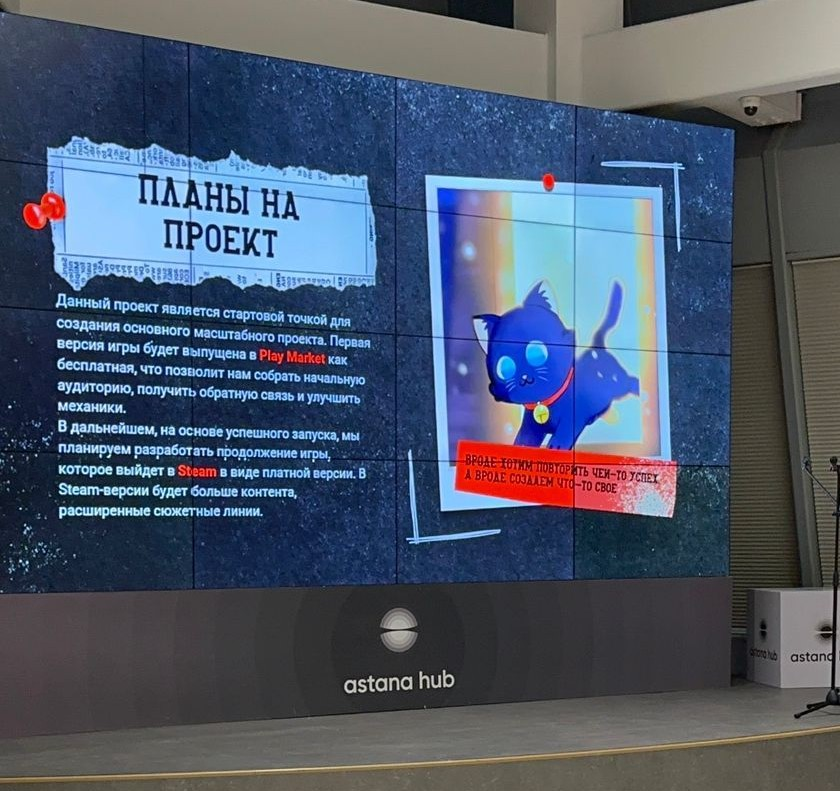

# Я Диля

## Обо мне
Я — студентка 2 курса ЕНУ, интересуюсь визуальным искусством, созданием игр и анализом данных. Работала 2D-художником в команде по геймдеву и участвовала в разработке и презентации игровой концепции. Мечтаю развиваться в сферах цифрового искусства и технологий.

## Навыки
- Рисование и концепт-арт для игр  
- Figma, Photoshop (начальный уровень)  
- Python (основы), Pandas, Matplotlib  
- Git, GitHub  
- Английский язык: B2, активно учу  

## Опыт и проекты
- 2D-художник в геймдев-проекте — участвовала в создании визуала для игры: интерфейс, персонажи,катсцены арты; представляла проект команде и ментору  
- Проекты по анализу данных — учебные работы на Python: визуализация, временные ряды, мини-исследования  

## Увлечения
Рисую в аниме-стиле, создаю стикеры, изучаю нейросети, интересуюсь геймдизайном и автотематикой (особенно Honda и JDM-культура)
## Примеры моих работ

### Представление геймдев-проекта

### Арт к игре

### Недавний арт

## Контакты
- Telegram: rasqqol
- Email: dilnaz.doszhan05@mail.com
